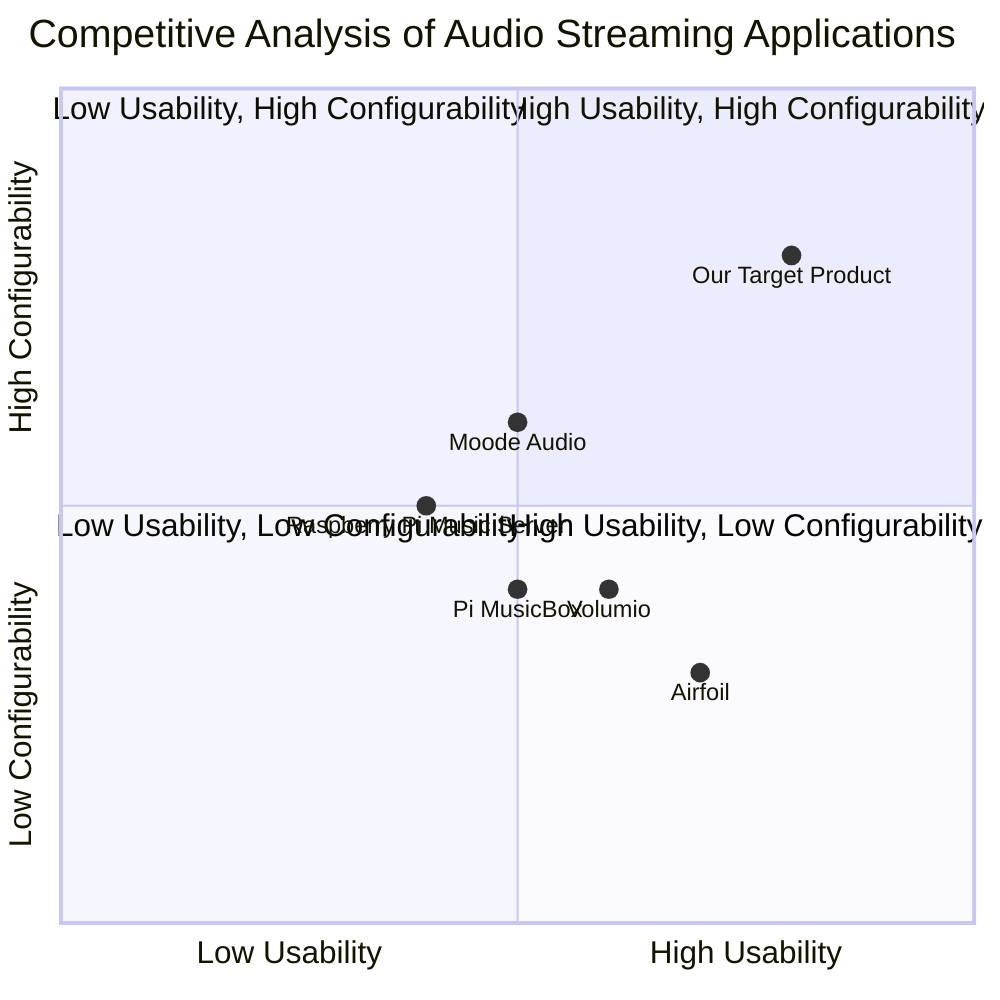

## Original Requirements
The boss wants an application that can be used with a Raspberry Pi to send audio from a record player line out to an Airplay only speaker. The application should have a web-based user interface that is easy to use and aesthetically pleasing. The app should also have a built-in web server and offer extensive configurability.

## Product Goals
```python
[
    "Create a user-friendly web-based application that can send audio from a record player to an Airplay only speaker using a Raspberry Pi.",
    "Ensure the application has a built-in web server and offers extensive configurability.",
    "Design an aesthetically pleasing user interface."
]
```

## User Stories
```python
[
    "As a user, I want to be able to easily configure the application so that I can send audio from my record player to my Airplay only speaker.",
    "As a user, I want a web-based application so that I can access it from any device.",
    "As a user, I want the application to have a built-in web server so that I can easily manage it.",
    "As a user, I want a visually appealing interface so that my user experience is enjoyable.",
    "As a user, I want to be able to use my Raspberry Pi with the application so that I can make use of my existing hardware."
]
```

## Competitive Analysis
```python
[
    "Airfoil: A well-established app that can send audio to Airplay devices, but lacks a web-based interface.",
    "Raspberry Pi Music Server: An open-source project that can send audio to various devices, but lacks a user-friendly interface.",
    "Volumio: A music player for Raspberry Pi with a web interface, but lacks extensive configurability.",
    "Moode Audio: A Raspberry Pi audio player with a web interface, but lacks support for Airplay only speakers.",
    "Pi MusicBox: A music player for Raspberry Pi with support for Airplay, but lacks a visually appealing interface."
]
```

## Competitive Quadrant Chart


## Requirement Analysis
The product should be a web-based application that can be used with a Raspberry Pi to send audio from a record player to an Airplay only speaker. It should have a built-in web server and offer extensive configurability. The user interface should be easy to use and visually appealing.

## Requirement Pool
```python
[
    ("The application should be able to send audio from a record player to an Airplay only speaker using a Raspberry Pi.", "P0"),
    ("The application should have a built-in web server.", "P0"),
    ("The application should offer extensive configurability.", "P0"),
    ("The application should have a web-based user interface.", "P0"),
    ("The user interface should be visually appealing.", "P0")
]
```

## UI Design draft
The user interface should be clean and minimalist, with a focus on usability. It should be divided into two main sections: a control panel for configuring the audio streaming and a settings section for managing the built-in web server and other application settings. The control panel should be the main focus of the interface, with large, easy-to-use controls. The settings section should be easily accessible but not intrusive.

## Anything UNCLEAR
There are no unclear points.