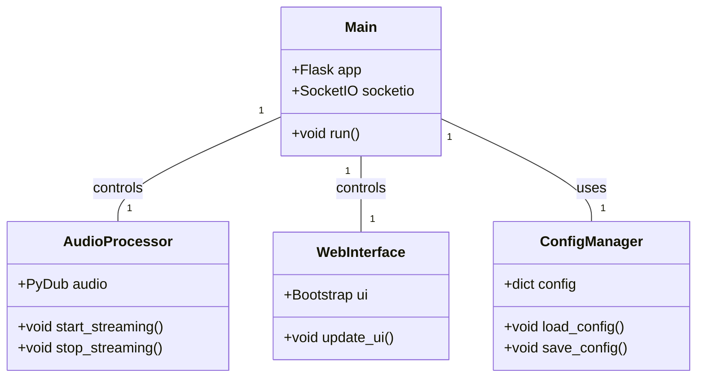
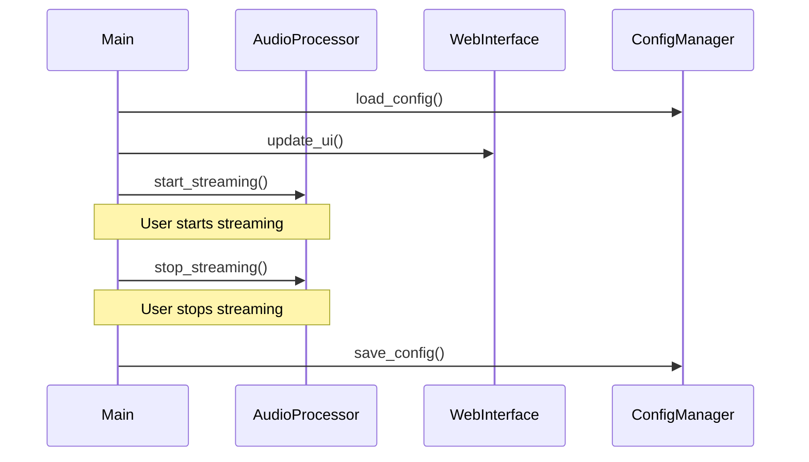

## Implementation approach
We will use Flask as our web framework due to its simplicity and flexibility. Flask-SocketIO will be used for real-time communication between the server and the web-based user interface. For the audio processing and transmission, we will use the PyDub library and shairport-sync, an open-source AirPlay audio player. The web interface will be built using Bootstrap for a responsive, modern design. The application will be packaged and distributed as a Docker container for easy deployment on a Raspberry Pi.

## Python package name
```python
"airplay_streamer"
```

## File list
```python
[
    "main.py",
    "audio_processor.py",
    "web_interface.py",
    "config_manager.py",
    "Dockerfile"
]
```

## Data structures and interface definitions


## Program call flow


## Anything UNCLEAR
The requirement is clear to me.